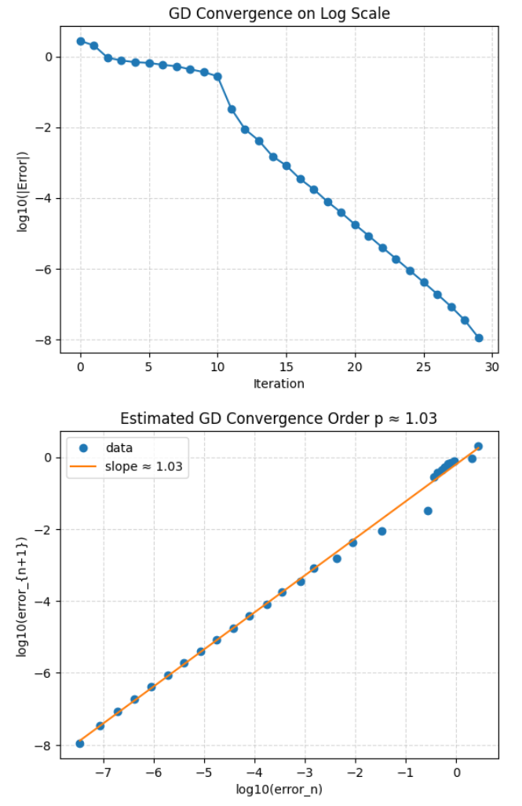
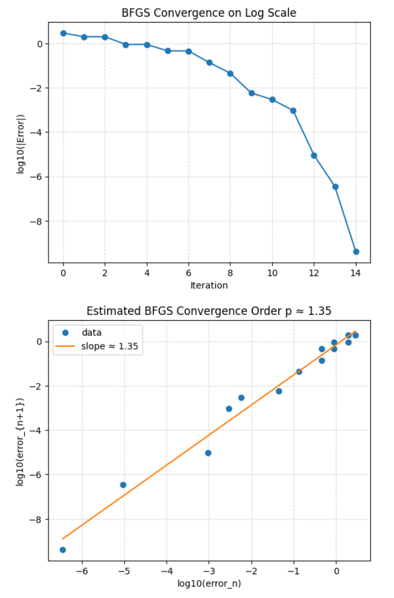
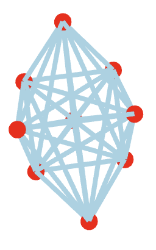

# Molecular Configurations

This is a project that uses numerical methods to stabilize molecular configurations. We implemented gradient descent with step size following the Armijo conditions for fast convergence. There's also an alternative implementation utilized BFGS and line search obeying the Wolfe conditions for extremely fast convergence.

